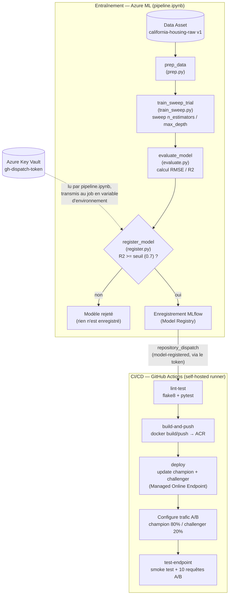

# California Housing — Pipeline MLOps sur Azure ML

## 1. Description du projet

Ce projet met en place une chaîne **MLOps de bout en bout** — de l'entraînement à la mise en production — pour un modèle de régression qui prédit la valeur médiane des maisons en Californie (dataset *California Housing Prices*).

Le pipeline couvre :
- le **versioning des données** dans Azure ML (Data Asset immuable, traçable) ;
- l'**entraînement automatisé** du modèle sur **Azure Machine Learning** (préparation des données, recherche d'hyperparamètres, évaluation, enregistrement conditionnel) avec **MLflow** pour le tracking et le versioning ;
- le **CI/CD** via **GitHub Actions**, déclenché automatiquement dès qu'un nouveau modèle passe le contrôle qualité ;
- le **déploiement en API REST** via un **Azure Managed Online Endpoint** ;
- de l'**A/B testing (Champion/Challenger)** entre deux versions du modèle, avec répartition du trafic.

Le modèle est un `RandomForestRegressor` (scikit-learn), entraîné avec recherche d'hyperparamètres (`n_estimators`, `max_depth`) et évalué sur `RMSE` et `R²`.

## 2. Mode de fonctionnement

Le projet s'articule en deux boucles automatisées qui s'enchaînent : le **pipeline d'entraînement** (Azure ML) déclenche le **pipeline de déploiement** (GitHub Actions) dès qu'un modèle est jugé assez bon.



Deux autres déclencheurs existent en parallèle du `repository_dispatch` : un `push`/`pull_request` sur `main` (relance lint + tests, et le déploiement sur `push`), et un déclenchement manuel (`workflow_dispatch`).

## 3. Structure du dépôt

```
mlops-california-housing/
├── .github/workflows/ci-cd.yml
├── pipeline/
│   ├── pipeline.ipynb
│   ├── environment/conda.yaml
│   ├── prep_src/prep.py
│   ├── train_src/train.py
│   ├── train_src/train_sweep.py
│   ├── evaluate_src/evaluate.py
│   └── register_src/register.py
├── deployment/
│   ├── Dockerfile
│   ├── requirements.txt
│   ├── score.py
│   ├── deployment_champion.yaml
│   └── deployment_challenger.yaml
├── tests/
│   ├── test_prep.py
│   └── test_score.py
├── test_api.py
├── sample-request.json
├── requirements-dev.txt
└── README.md
```

| Fichier / dossier | Rôle |
|---|---|
| `.github/workflows/ci-cd.yml` | Définition du pipeline CI/CD : lint, tests, build/push de l'image Docker, déploiement Champion/Challenger, configuration du trafic A/B, tests de l'endpoint. |
| `pipeline/pipeline.ipynb` | Notebook qui définit et soumet le pipeline d'entraînement complet via le SDK Azure ML v2 (connexion au workspace, création de l'environnement d'entraînement, lecture du secret GitHub depuis Azure Key Vault, définition des paramètres nécessaires au job, assemblage des 4 étapes du pipeline, soumission du job). |
| `pipeline/environment/conda.yaml` | Environnement Conda figé utilisé pour l'exécution des étapes du pipeline sur Azure ML (versions exactes de scikit-learn, pandas, mlflow, etc.). |
| `pipeline/prep_src/prep.py` | Étape 1 : nettoyage des données (valeurs manquantes), feature engineering, encodage, split train/validation. |
| `pipeline/train_src/train.py` | Variante d'entraînement simple (un seul essai, sans sweep) avec tracking automatique MLflow. |
| `pipeline/train_src/train_sweep.py` | Étape 2 utilisée dans le pipeline : entraîne un essai du sweep d'hyperparamètres et logge RMSE/R² comme métrique cible. |
| `pipeline/evaluate_src/evaluate.py` | Étape 3 : évalue le meilleur modèle du sweep sur le jeu de validation et sauvegarde les métriques. |
| `pipeline/register_src/register.py` | Étape 4 : n'enregistre le modèle dans le Model Registry MLflow que si le R² dépasse le seuil, puis utilise le token transmis par le job pour déclencher le CI/CD GitHub via `repository_dispatch`. |
| `deployment/Dockerfile` | Image du service de scoring, basée sur `python:3.10-slim`, qui lance le serveur d'inférence `azmlinfsrv` sur le port 5001. |
| `deployment/requirements.txt` | Dépendances Python de l'image de scoring (scikit-learn, pandas, joblib, azureml-inference-server-http). |
| `deployment/score.py` | Script de scoring exécuté par l'endpoint : charge le modèle (`init`) et répond aux requêtes de prédiction (`run`). |
| `deployment/deployment_champion.yaml` | Définition du déploiement Champion (modèle, image, routes, type d'instance). |
| `deployment/deployment_challenger.yaml` | Définition du déploiement Challenger (modèle, image, routes, type d'instance). |
| `tests/test_prep.py` | Tests unitaires de la logique de nettoyage/feature engineering de `prep.py`. |
| `tests/test_score.py` | Tests unitaires de la logique de `run()` dans `score.py`, avec un modèle factice. |
| `test_api.py` | Script d'appel manuel de l'endpoint déployé, à des fins de test. |
| `sample-request.json` | Exemple de requête JSON envoyée à l'endpoint (format attendu par `score.py`). |
| `requirements-dev.txt` | Dépendances pour le lint et les tests (flake8, pytest, pandas, scikit-learn). |

## 4. Dataset utilisé

Le dataset est **California Housing Prices**, dérivé du recensement californien de 1990 (10 colonnes, ~20 640 lignes), avec pour cible la valeur médiane des logements par bloc.

| Colonne | Description |
|---|---|
| `longitude`, `latitude` | Coordonnées géographiques du bloc |
| `housing_median_age` | Âge médian des logements du bloc |
| `total_rooms`, `total_bedrooms` | Nombre total de pièces / de chambres dans le bloc |
| `population`, `households` | Population et nombre de foyers du bloc |
| `median_income` | Revenu médian des foyers (en dizaines de milliers de $) |
| `ocean_proximity` | Catégorie de proximité à l'océan (`<1H OCEAN`, `INLAND`, `ISLAND`, `NEAR BAY`, `NEAR OCEAN`) |
| `median_house_value` | **Cible** : valeur médiane des logements du bloc (en $) |

Une vérification préalable a montré 207 valeurs manquantes (≈1 %), toutes sur la seule colonne `total_bedrooms` — un taux jugé négligeable, géré à l'étape de préparation (`prep.py`) par remplacement par la médiane.

`prep.py` dérive ensuite trois features supplémentaires (`rooms_per_household`, `bedrooms_per_room`, `population_per_household`) et encode `ocean_proximity` en one-hot (`pd.get_dummies`, `drop_first=True`) — c'est ce format, visible dans `sample-request.json`, qu'attend le modèle en entrée.

## 5. Tester le projet

### 5.1. En local (sans Azure)

Ce qui peut être vérifié sans aucune ressource Azure : la qualité du code et la logique métier des scripts.

```bash
git clone <url-du-dépôt>
cd mlops-california-housing

python -m venv venv
source venv/bin/activate   (# sous Windows : venv\Scripts\activate)

pip install -r requirements-dev.txt

# Lint
flake8 pipeline/ deployment/ tests/ --max-line-length=120 --extend-ignore=E402

# Tests unitaires
pytest tests/ -v
```

## 6. Infrastructure Azure

### 6.1. Ressources créées manuellement (depuis le portail Azure, sans CLI ni IaC)

- **Groupe de ressources** : `afenichamal` — Portail Azure → barre de recherche « Groupes de ressources » → **+ Créer** → renseigner nom et région.
  *Rôle : conteneur logique qui regroupe toutes les ressources du projet.*
- **Workspace Azure Machine Learning** : `ws-mlops-stage-amal` — Portail Azure → barre de recherche « Azure Machine Learning » → **+ Créer** → renseigner groupe de ressources, nom, région.
  *Rôle : environnement central pour l'entraînement, le tracking MLflow et le déploiement des modèles ; sa création déclenche automatiquement les ressources de la section 6.1.*
- **Instance de calcul** (`Standard_DS2_v2`) — dans le workspace (ml.azure.com) → **Gérer → Calcul → Instances de calcul → + Nouveau**.
  *Rôle : machine de développement interactif pour exécuter `pipeline.ipynb` et héberger le runner GitHub Actions.*
- **Cluster de calcul d'entraînement** (`cpu-cluster-train`) — dans le workspace → **Gérer → Calcul → Clusters de calcul → + Nouveau**, nommer exactement `cpu-cluster-train`.
  Taille de VM : `Standard_F2s_v2` (famille Fsv2).
  *Rôle : cible d'exécution des 4 étapes du pipeline (préparation, sweep, évaluation, enregistrement).*
  Cette taille a été choisie pour éviter un conflit de quota avec le déploiement Champion, qui utilisait déjà des ressources de la famille DSv2.

### 6.2. Ressources créées automatiquement

Après la création manuelle de notre workspace Azure Machine Learning (section 6.1). Ces ressources sont alors provisionnées automatiquement, dans le même groupe de ressources que nous avons déjà crée :

- **Coffre de clés (Key Vault)** : stocke de façon sécurisée les secrets et clés sensibles utilisés par le workspace (ex. le token GitHub).
- **Compte de stockage** : stocke les données, les artefacts de run et les logs du workspace.
- **Espace de travail Log Analytics** : centralise les logs et métriques de supervision du workspace.
- **Application Insights** : collecte la télémétrie et les métriques de performance des endpoints déployés.
- **Azure Container Registry (ACR)** : héberge les images Docker construites pour le workspace, ici l'image de scoring `california-housing-scoring`.

### 6.3. Versioning du dataset

- **Conteneur de stockage `datasets-bruts`** — Portail Azure → compte de stockage du workspace → Conteneurs → **+ Conteneur**, nommer `datasets-bruts`, puis y déposer le fichier CSV du dataset (upload direct dans le conteneur).
  Vérifier au préalable que l'espace de noms hiérarchique est désactivé sur ce compte (Configuration) : dans ce cas c'est du Blob Storage standard, pas un vrai Data Lake Gen2 — sans impact sur la suite.
- **Datastore `datastore_datasets_bruts`** — dans le workspace (ml.azure.com) → **Gérer → Données → Magasins de données → + Créer**, pointer vers le conteneur `datasets-bruts`, nommer `datastore_datasets_bruts`, et configurer l'authentification via la clé de compte du stockage.
  Le datastore par défaut du workspace (`workspaceblobstore`) pointe vers un autre conteneur interne : il faut donc bien créer ce datastore dédié.
- **Data Asset `california-housing-raw`** — dans le workspace → **Auteur → Données → + Créer**, type Fichier, sélectionner le fichier via le datastore `datastore_datasets_bruts` créé ci-dessus. Le Data Asset apparaît avec Version 1.
  *Rôle : référence immuable et traçable du dataset, utilisée par `pipeline.ipynb` pour les jobs d'entraînement futurs.*

## 7. Runner self-hosted GitHub Actions

Le **runner self-hosted** est la machine qui exécute certains jobs GitHub Actions du projet. Dans notre cas, il permet d'exécuter les étapes du CD directement sur l'instance de calcul Azure ML.

Le runner a été installé manuellement sur l'instance de calcul Azure ML et n'est pas créé par `pipeline.ipynb`.

### Installation du runner

Pour installer le runner, accéder au dépôt GitHub :

**Settings → Actions → Runners → New self-hosted runner**

Ensuite :

1. Choisir **Linux** comme système d'exploitation.
2. Choisir **x64** comme architecture.
3. GitHub affiche automatiquement les commandes nécessaires à l'installation et à la configuration du runner.
4. Exécuter ces commandes **telles qu'elles sont affichées par GitHub** dans le terminal de l'instance de calcul Azure ML.

Une fois l'installation terminée, le runner est associé au dépôt et peut recevoir les jobs GitHub Actions.

### Redémarrer le runner

Si le runner a déjà été installé et qu'on souhaite simplement le démarrer à nouveau, il n'est pas nécessaire de refaire toute l'installation.

Dans le terminal Azure ML, se placer dans le dossier du runner :

```bash
cd actions-runner
./run.sh
```

### 7.1. Token GitHub pour le déclenchement automatique

Le token utilisé par `register.py` est stocké dans Azure Key Vault sous le secret `gh-dispatch-token`.

1. Sur GitHub : **Settings**.
2. **Developer settings**.
3. **Personal access tokens → Fine-grained tokens → Generate new token**.
4. Limiter le token au dépôt `mlops-california-housing`.
5. Donner au minimum **Contents : Read and write**.
6. Générer le token.
7. Déposer sa valeur dans le Key Vault :
   ```bash
   az keyvault secret set \
     --vault-name wsmlopsstageam2393667510 \
     --name gh-dispatch-token \
     --value <TOKEN_GITHUB>
   ```

Ne jamais mettre le token directement dans le notebook, dans `register.py`, dans GitHub ou dans le dépôt.

## 8. Exécution du pipeline et suivi

Une fois l'infrastructure, le cluster et le runner en place :

1. Exécuter les cellules de `pipeline/pipeline.ipynb` depuis l'instance de calcul. Le notebook prépare l'environnement, récupère le token GitHub depuis Azure Key Vault et le transmet au job comme variable d'environnement, puis soumet le pipeline complet.
2. La dernière cellule affiche un lien (`submitted_job.studio_url`) vers le job dans Azure ML Studio.
3. Les étapes du pipeline sont exécutées dans l'ordre : préparation, essais du sweep, évaluation puis enregistrement.
4. Si le R² du meilleur essai dépasse le seuil de 0,7, `register.py` enregistre le modèle dans le Model Registry MLflow.
5. `register.py` utilise ensuite le token déjà transmis au job pour envoyer l'événement `repository_dispatch` de type `model-registered` vers GitHub.
6. Dans GitHub, l'onglet **Actions** affiche alors la nouvelle exécution de `CI/CD - California Housing Model`.
7. Les jobs `lint-test`, `build-and-push`, `deploy` et `test-endpoint` s'exécutent jusqu'au déploiement des versions `champion` et `challenger` et à la configuration du trafic A/B.

### 8.1. Déclenchement automatique

Le mécanisme automatique est donc :

```
pipeline.ipynb
      │
      ▼
Azure Key Vault
      │
      │ récupération du secret gh-dispatch-token
      ▼
Job Azure ML
      │
      │ variable d'environnement
      ▼
register.py
      │
      │ repository_dispatch
      ▼
GitHub Actions
      │
      ├── lint-test
      ├── build-and-push
      ├── deploy
      └── test-endpoint
```

### 8.2. Contrôle qualité du modèle

Le modèle est enregistré uniquement si le R² obtenu respecte le seuil défini dans le pipeline.

- R² < 0,7 : le modèle est rejeté et le déclenchement GitHub n'est pas effectué.
- R² ≥ 0,7 : le modèle est enregistré puis le workflow GitHub Actions est déclenché.

Les métriques obtenues lors de l'exécution de référence sont : RMSE = 50 062,77 — R² = 0,8087.

## 9. CI/CD et déploiement

Le workflow `.github/workflows/ci-cd.yml` contient les étapes suivantes :

- **lint-test** : `flake8`, `pytest`.
- **build-and-push** : connexion à Azure Container Registry, construction de l'image Docker, push de l'image `california-housing-scoring`.
- **deploy** : mise à jour du déploiement `champion`, mise à jour du déploiement `challenger` (avec le modèle enregistré correspondant à la version reçue par `repository_dispatch`).
- **A/B testing** : champion 80 %, challenger 20 %.
- **test-endpoint** : vérification de l'endpoint, envoi de requêtes de test.

La commande utilisée pour configurer le trafic, telle qu'elle est réellement définie dans le workflow, est :

```bash
az ml online-endpoint update \
  --name california-housing-endpoint \
  --resource-group afenichamal \
  --workspace-name ws-mlops-stage-amal \
  --traffic "champion=80 challenger=20"
```

## 10. Tests

### Tests locaux

```bash
flake8 pipeline/ deployment/ tests/ --max-line-length=120 --extend-ignore=E402
pytest tests/ -v
```

Les tests couvrent notamment :
- le traitement des valeurs manquantes ;
- la création des features ;
- l'encodage des variables catégorielles ;
- le format des prédictions ;
- la gestion d'une entrée JSON invalide.

### Test de l'API

Le script `test_api.py` permet de tester l'endpoint déployé. Il utilise la bibliothèque `requests`, qui n'est pas listée dans `requirements-dev.txt` — l'installer séparément si besoin :

```bash
pip install requests
python test_api.py
```

L'URL et la clé de l'endpoint sont codées en dur dans le script (voir section 8, étape sur `az ml online-endpoint get-credentials` pour récupérer les tiennes) ; il faut les remplacer par celles de ton propre déploiement avant exécution.

Lors du test réalisé, l'API a retourné HTTP 200 avec une prédiction d'environ 408161,85.

## 11. Ressources principales du projet

| Élément | Valeur |
|---|---|
| Subscription | Smartovate |
| Resource Group | afenichamal |
| Workspace | ws-mlops-stage-amal |
| Région | eastus |
| Cluster d'entraînement | cpu-cluster-train |
| VM du cluster | Standard_F2s_v2 |
| Instance de calcul | Standard_DS2_v2 |
| Data Asset | california-housing-raw v1 |
| Modèle | california-housing-model |
| Key Vault | wsmlopsstageam2393667510 |
| Secret Key Vault | gh-dispatch-token |
| ACR | b2f79a6b7a564a19ab373ce9c22c2bc6 |
| Image Docker | california-housing-scoring |
| Endpoint | california-housing-endpoint |
| Trafic A/B | champion=80 challenger=20 |
| Modèle ML | RandomForestRegressor |
| R² de référence | 0.8087 |
| RMSE de référence | 50062.77 |

## 12. Résultat final

Le projet permet d'obtenir une chaîne MLOps automatisée :

```
Dataset versionné
      ↓
Pipeline Azure ML
      ↓
Préparation des données
      ↓
Recherche d'hyperparamètres
      ↓
Évaluation RMSE / R²
      ↓
Contrôle du seuil
      ↓
Enregistrement du modèle
      ↓
Déclenchement GitHub automatique
      ↓
Lint + Tests
      ↓
Build Docker
      ↓
Push vers ACR
      ↓
Déploiement Champion / Challenger
      ↓
Trafic A/B 80 / 20
      ↓
Test de l'API REST
```

L'ensemble permet de démontrer le passage d'un entraînement de modèle à une mise en production automatisée, reproductible et suivie, avec versioning du dataset et du modèle, CI/CD, déploiement REST et expérimentation Champion/Challenger.
